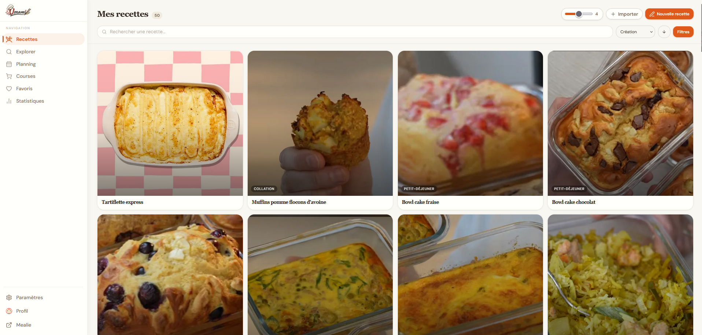
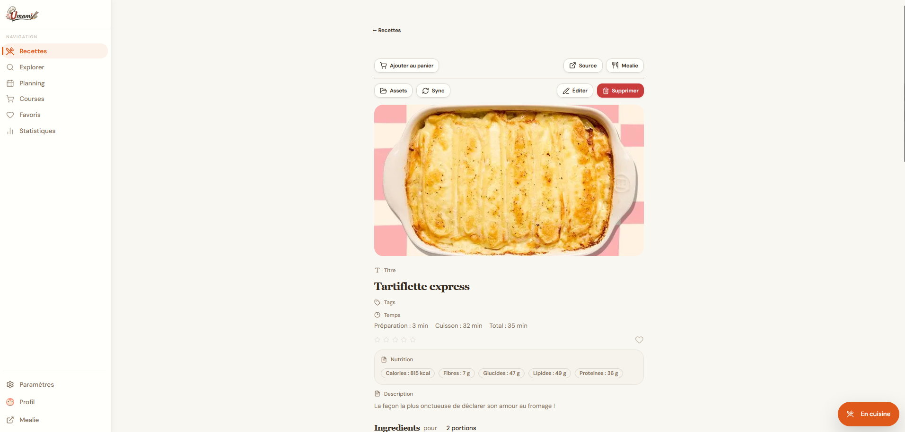
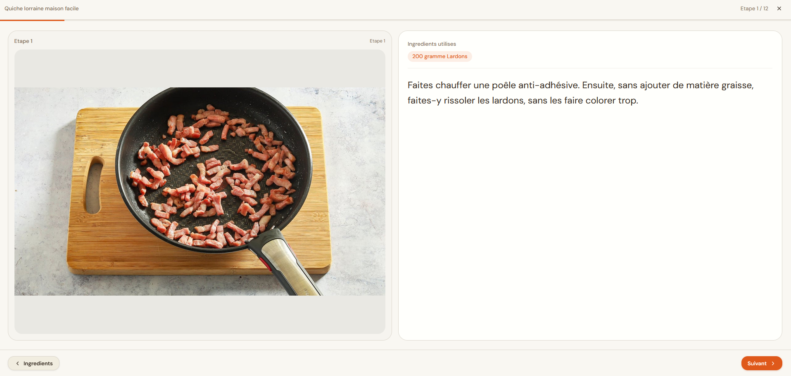
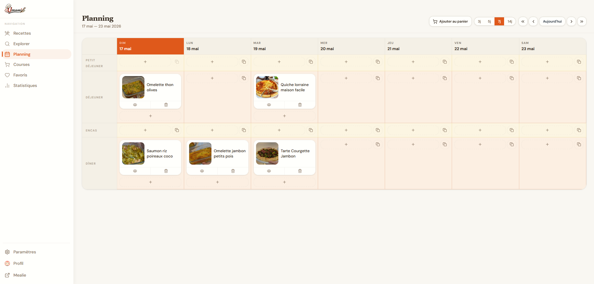

# Umami

Umami est une interface web locale pour piloter et enrichir une instance Mealie. Le projet part de [bonap](https://github.com/AymericLeFeyer/bonap), puis ajoute une couche plus orientee cuisine quotidienne : exploration de recettes, imports aides, planning, courses, favoris, statistiques, mode cuisine et outils de nettoyage.

## Warning

Ce projet est **vibe-coded** et doit rester un outil personnel/local. Ne l'exposez pas directement sur Internet.

Gardez Umami derriere votre reseau local, un VPN ou un acces protege, et evitez de publier l'application telle quelle sur un domaine public. Elle manipule une session Mealie, des recettes, des courses et des donnees personnelles de cuisine : le bon usage est une installation maison, locale, controlee.

## Presentation

Umami sert de compagnon a Mealie : il ne remplace pas votre base Mealie, il la rend plus agreable a utiliser au quotidien.

<p>
  
  
</p>
<p>
  
  
</p>

Les grandes lignes :

- Catalogue de recettes avec recherche, filtres, tri, favoris, notes et affichage en grille ajustable.
- Detail de recette enrichi avec nutrition, ingredients, temps, description, synchronisation Mealie et acces aux assets.
- Mode cuisine etape par etape, avec les ingredients utiles par etape.
- Ajout d'images aux etapes de preparation.
- Ajout possible de videos aux etapes, notamment via l'import video Jow, fonctionnalite non disponible nativement dans Mealie.
- Planning hebdomadaire avec repas par creneau, duplication, suppression et ajout au panier.
- Liste de courses plus pratique, avec cellier pour deduire ce que vous avez deja et elements habituels que vous ajoutez souvent.
- Statistiques et tris utiles : recettes jamais planifiees, repartition par categories, couverture du catalogue, calories et donnees nutritionnelles quand elles sont disponibles.

## Explorer et importer

La page Explorer permet de chercher des recettes sur des sources externes puis de les importer dans Mealie avec une revue des ingredients.

Sites compatibles :

- Marmiton
- Jow
- 750g

Fonctions autour de l'import :

- Recherche distante par source.
- Import depuis URL compatible.
- Detection et revue des ingredients avant creation.
- Import automatique d'image quand la source fournit une image exploitable.
- Normalisation des noms, quantites et unites quand c'est possible.
- Detection de doublons pour eviter de recreer une recette deja presente.
- Pour Jow : import supplementaire des videos et des chapitres, afin d'associer des medias aux etapes.

## Donnees et maintenance

Umami ajoute plusieurs outils pour mieux maintenir une base Mealie qui grandit :

- Tags auto-nettoyants pour reduire les doublons, variantes et libelles inutiles.
- Fonctions de fusion pour rapprocher des aliments, tags, unites ou categories similaires.
- Gestion du cellier : les courses peuvent tenir compte des produits deja disponibles.
- Gestion des elements habituels : pratique pour les achats recurrents qui ne viennent pas toujours d'une recette.
- Analyse des calories et tags nutritionnels, zone que Mealie ne couvre pas toujours selon les donnees importees.
- Liens ingredients/etapes pour savoir quels ingredients sont utilises a chaque moment de la recette.
- Filtres et tris supplementaires pour retrouver plus vite les recettes utiles.
- Pages de maintenance pour categories, aliments, labels, tags, unites et ustensiles.

## Lancement local

Prerequis :

- Node.js
- npm
- Une instance Mealie accessible depuis votre machine

Installation :

```bash
npm install
```

Demarrage en developpement :

```bash
npm run dev
```

Scripts utiles :

- `npm run dev` : lance le frontend Vite et le proxy de recherche.
- `npm run dev:frontend` : lance uniquement le frontend Vite.
- `npm run dev:proxy` : lance uniquement le proxy de recherche de recettes.
- `npm run build` : genere le build de production.
- `npm run lint` : verifie le code avec ESLint.
- `npm run preview` : previsualise le build.

## Docker

Exemple avec une instance Mealie deja existante :

```yaml
services:
  umami:
    image: ghcr.io/sargo22341-prog/umami:latest
    depends_on:
      - recipes-search-proxy
    ports:
      - "3000:80"
    environment:
      VITE_MEALIE_URL: "http://mon-mealie:9000"
      VITE_THEME: "system"
      VITE_ACCENT_COLORS: "orange"
    restart: unless-stopped

  recipes-search-proxy:
    image: ghcr.io/sargo22341-prog/umami-recipes-search-proxy:latest
    restart: unless-stopped
```

Exemple complet avec Mealie :

```yaml
services:
  mealie:
    image: ghcr.io/mealie-recipes/mealie:latest
    ports:
      - "9000:9000"
    volumes:
      - mealie-data:/app/data
    environment:
      ALLOW_SIGNUP: "false"
      BASE_URL: "http://localhost:9000"
      TZ: "Europe/Paris"
    restart: unless-stopped

  umami:
    image: ghcr.io/sargo22341-prog/umami:latest
    depends_on:
      - recipes-search-proxy
    ports:
      - "3000:80"
    environment:
      VITE_MEALIE_URL: "http://localhost:9000"
      VITE_THEME: "system"
      VITE_ACCENT_COLORS: "orange"
    restart: unless-stopped

  recipes-search-proxy:
    image: ghcr.io/sargo22341-prog/umami-recipes-search-proxy:latest
    restart: unless-stopped

volumes:
  mealie-data:
```

Pour builder localement au lieu d'utiliser les images :

```yaml
services:
  umami:
    build:
      context: .
      target: runner

  recipes-search-proxy:
    build:
      context: .
      target: recipes-search-proxy
```

Demarrage :

```bash
docker compose up -d
```

## Variables d'environnement

Les variables sont injectees au runtime Docker par `docker-entrypoint.sh` dans `env-config.js`. En developpement, Vite utilise les variables `VITE_*` disponibles dans l'environnement.

| Variable | Obligatoire | Valeur par defaut | Exemple | Description |
| --- | --- | --- | --- | --- |
| `VITE_MEALIE_URL` | Oui | `""` | `http://localhost:9000` | URL de votre instance Mealie. En dev, sert aussi de cible au proxy `/api`. |
| `VITE_THEME` | Non | `system` | `light`, `dark`, `system` | Theme initial si l'utilisateur n'a rien choisi dans le navigateur. |
| `VITE_ACCENT_COLORS` | Non | `orange` | `orange`, `blue`, `violet`, `green`, `rose`, `teal`, `amber`, `indigo`, `rgba(223, 89, 27, 1)` | Couleur d'accent initiale. Accepte un preset ou une couleur CSS valide. |

Notes :

- Le proxy de recherche ecoute en interne sur le port `3001`.
- Le conteneur frontend expose Nginx sur le port `80`; le `docker-compose.yml` fourni le publie sur `3000`.
- Les choix faits dans l'interface peuvent etre conserves dans le `localStorage` du navigateur et prendre le dessus sur les valeurs par defaut.
